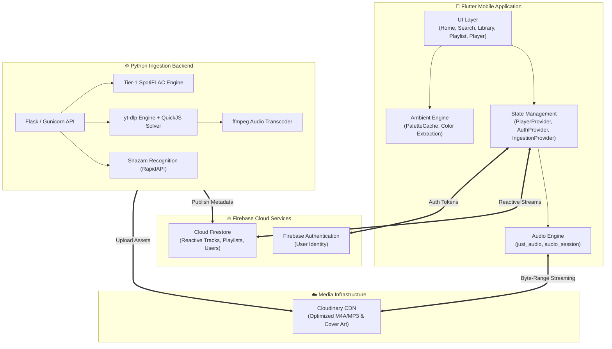

<div align="center">


# 🎵 Spotify Clone

### A high-fidelity, pixel-perfect music streaming ecosystem built with Flutter, Firebase, and Python

<br/>

[](https://flutter.dev)
[](https://dart.dev)
[](https://firebase.google.com)
[](https://cloudinary.com)
[](https://flask.palletsprojects.com)
[](https://www.docker.com)
[](LICENSE)
[](https://flutter.dev)

<br/>

> **Lossless & High-Bitrate Streaming** · **Real-Time Reactive Database** · **Dynamic Ambient Color UI** · **Automated Ingestion Pipeline**

<br/>

[Key Features](#-key-features) • [System Architecture](#-system-architecture) • [Tech Stack](#-tech-stack) • [Quick Start](#-quick-start) • [Database Schema](#-database-schema) • [Security](#-security--credentials) • [Project Structure](#-project-structure)

</div>

---

## ✨ Key Features

<table>
<tr>
<td width="50%" valign="top">

### 🎧 Seamless Music Playback
- **High-Fidelity Streaming**: Cloudinary CDN audio delivery with persistent background playback via `just_audio` and `audio_session`.
- **Media Notification & Lock Screen**: Full system notification integration with scrubber, play/pause, skip, and metadata artwork.
- **Interactive Player Controls**: Seek bar with buffer indicator, shuffle, repeat modes, and queue management.
- **Persistent Mini-Player**: Bottom docked mini-player across all screens with fluid gesture expansion to full-screen Now Playing.
- **Synchronized Lyrics**: Karaoke-style real-time synced lyrics with auto-scroll and line-highlighting animations.

</td>
<td width="50%" valign="top">

### 📂 Advanced Playlist Management
- **Smart Sorting System**:
  - 🕒 **Recently Added**: Real-time reverse chronological order of additions.
  - 🔤 **Alphabetical (A-Z)**: Title, Artist, and Album sorting with tie-breakers.
  - 🎛️ **Custom Order**: User-defined sequence with instantaneous Firestore sync.
- **Drag-and-Drop Reordering**: Interactive reordering via smooth drag listeners.
- **Multi-Select Batch Actions**: Long-press multi-track selection to batch move, copy, or delete songs between playlists.
- **Live In-Playlist Search**: Instant filter inside playlists with search-rank weighting.

</td>
</tr>
<tr>
<td width="50%" valign="top">

### 🎨 Pixel-Perfect Spotify UI/UX
- **Ambient Cover Extraction**: Dynamic background mesh gradients derived in real-time from album art using cached palette extractors.
- **Spotify Design System**: Custom Spotify typography, sleek dark mode palettes, rounded pills, and custom icon sets.
- **Animated Splash & Micro-Interactions**: Smooth Hero transitions, spring curves, and pulsing wave visualizers.
- **Flexible Views**: Switch effortlessly between compact grid and detailed list layouts across the library.

</td>
<td width="50%" valign="top">

### ⚡ Dual-Engine Ingestion Backend
- **Tier-1 SpotiFLAC Engine**: Direct high-quality lossless track retrieval with automatic fallback to YouTube via `yt-dlp`.
- **Shazam Audio Fingerprinting**: Automated track recognition, artist normalization, and official album art tagging.
- **Memory-Safe Architecture**: Bound <150MB footprint with single-thread `ffmpeg`, garbage collector cycles, and Gunicorn request recycling.
- **Universal Container**: Ready for deployment on Docker, Hugging Face Spaces (16GB RAM), and Render.

</td>
</tr>
</table>

---

## 🏗 System Architecture



---

## 🛠 Tech Stack

| Domain | Technology | Purpose |
|---|---|---|
| **Frontend Framework** | **Flutter 3.x (Dart 3.x)** | Cross-platform client for Android, iOS, and Web |
| **State Management** | **Provider** | Reactive state handling across audio, auth, and playlists |
| **Audio Engine** | **just_audio** + **audio_session** | Low-latency audio streaming, buffering, lockscreen controls |
| **Backend API** | **Python 3.11+ / Flask** | High-performance async ingestion microservice |
| **Production Server** | **Gunicorn** + **Docker** | Production containerization with resource boundaries |
| **Database** | **Firebase Firestore** | Real-time reactive document store with offline caching |
| **Authentication** | **Firebase Auth** | Secure user credentials and session management |
| **Media CDN** | **Cloudinary** | Audio streaming distribution and CDN image optimization |
| **Audio Fingerprinting**| **Shazam API** | Automated metadata recognition and catalog enrichment |
| **Audio Processing** | **ffmpeg** + **yt-dlp** | Stream extraction, format transcoding, and normalization |

---

## ⚡ Quick Start

### Prerequisites
- **Flutter SDK**: `^3.22.0` or higher
- **Dart SDK**: `^3.4.0` or higher
- **Python**: `3.10` or `3.11`
- **Docker** *(optional, for backend containerization)*

---

### 1️⃣ Clone and Install Dependencies

```bash
git clone https://github.com/JoyalJose54/Spotify_clone.git
cd Spotify_clone

# Install Flutter packages
flutter pub get
```

---

### 2️⃣ Configure Firebase (Client)

1. Navigate to the [Firebase Console](https://console.firebase.google.com/) and create a project.
2. Enable **Authentication** (Email/Password) and **Cloud Firestore**.
3. Download your Android `google-services.json` and place it in the application:
   ```bash
   cp google-services.json.example android/app/google-services.json
   ```
4. Update `android/app/google-services.json` with your real project IDs and API keys.

---

### 3️⃣ Configure Backend & Database Credentials

```bash
# 1. Setup Firebase Admin SDK credentials
cp database/firebase-key.json.example database/firebase-key.json

# 2. Setup environment variables for the Python backend
cp cloud_functions/.env.example cloud_functions/.env
```

Edit `cloud_functions/.env` with your provider keys:
```env
CLOUDINARY_CLOUD_NAME=your_cloud_name
CLOUDINARY_API_KEY=your_api_key
CLOUDINARY_API_SECRET=your_api_secret
SHAZAM_KEYS=your_rapidapi_shazam_key
FIREBASE_CREDENTIALS_JSON=../database/firebase-key.json
PORT=7860
```

---

### 4️⃣ Run the Application

#### Option A: Local Development
```bash
# Terminal 1: Launch the Ingestion Backend
cd cloud_functions
python -m venv venv
# Windows:
.\venv\Scripts\activate
# macOS/Linux:
source venv/bin/activate

pip install -r requirements.txt
python main.py

# Terminal 2: Launch Flutter App
flutter run
```

#### Option B: Docker Backend
```bash
docker build -t spotify-backend .
docker run -p 7860:7860 --env-file cloud_functions/.env spotify-backend
```

---

## 🗂 Database Schema

<details>
<summary>📀 <strong>tracks</strong> collection</summary>

```json
{
  "id": "0MHtdGtxPhDGlfDnj957",
  "title": "Blinding Lights",
  "artist": "The Weeknd",
  "album": "After Hours",
  "secure_url": "https://res.cloudinary.com/.../audio/blinding-lights.m4a",
  "imageUrl": "https://res.cloudinary.com/.../covers/after-hours.jpg",
  "duration_ms": 200040,
  "trackNumber": 1,
  "isExplicit": false,
  "title_lc": "blinding lights",
  "artist_lc": "the weeknd",
  "alias_keys": ["blinding lights||the weeknd"],
  "video_id": "4NRXx6U8ABQ",
  "addedAt": "2026-05-17T17:53:51Z"
}
```
</details>

<details>
<summary>📋 <strong>playlists</strong> collection</summary>

```json
{
  "name": "Late Night Vibes",
  "description": "Chill beats and atmospheric melodies",
  "imageUrl": "https://res.cloudinary.com/.../covers/playlist.jpg",
  "owner": "Joyal Jose",
  "trackIds": [
    "0MHtdGtxPhDGlfDnj957",
    "0NmJlF16GQUcsfRZXDU3"
  ],
  "likes": 42,
  "isSpotifyOwned": false,
  "createdAt": "2026-06-01T12:00:00Z"
}
```
</details>

---

## 🔒 Security & Credentials

> [!IMPORTANT]
> **No secret keys, private credentials, or live certificates are ever checked into this repository.**

All configuration and secrets are maintained strictly via environment variables and ignored template patterns:

| Sensitive File | Purpose | Sample Template |
|---|---|---|
| `android/app/google-services.json` | Firebase Android configuration | `google-services.json.example` |
| `database/firebase-key.json` | Firebase Admin SDK credentials | `database/firebase-key.json.example` |
| `cloud_functions/.env` | Cloudinary, Shazam & API keys | `cloud_functions/.env.example` |
| `assets/cookies/yt_cookies.txt` | YouTube session tokens (optional) | `assets/cookies/yt_cookies.txt.example` |

Ensure that your local `.env` and `*.json` keys remain strictly uncommitted. `.gitignore` is comprehensively configured to safeguard these assets automatically.

---

## 📁 Project Structure

```
Spotify_clone/
├── android/                               # Native Android configuration (Kotlin DSL)
│   ├── app/
│   │   ├── build.gradle.kts               # App-level build config
│   │   └── src/main/                      # AndroidManifest & application assets
│   ├── build.gradle.kts                   # Root Android gradle configuration
│   └── settings.gradle.kts                # Plugin and dependency resolution
│
├── cloud_functions/                       # Python Ingestion & Processing Microservice
│   ├── main.py                            # Flask server entrypoint & API endpoints
│   ├── requirements.txt                   # Microservice dependencies
│   ├── Dockerfile                         # Container definition for HF Spaces / Render
│   └── .env.example                       # Environment variables template
│
├── database/                              # Database maintenance & ingestion utilities
│   ├── clean_unnecessary_tags.py          # Firestore document cleanup utility
│   ├── inspect_fields.py                  # Schema analyzer & field validator
│   ├── sync_to_cloud.py                   # Local audio → Cloudinary sync utility
│   ├── download_playlist.py               # Automated playlist batch downloader
│   └── firebase-key.json.example          # Service account key template
│
├── lib/                                   # Flutter Core Codebase
│   ├── main.dart                          # App entry, Firebase & AudioService setup
│   ├── models/
│   │   └── models.dart                    # Song, Playlist, Artist models & deserializers
│   ├── providers/
│   │   ├── app_provider.dart              # Audio playback & Authentication providers
│   │   └── ingestion_provider.dart        # Real-time ingestion state management
│   ├── screens/
│   │   ├── home/                          # Home feed, recommendations, playlists
│   │   ├── library/                       # User library, liked songs, following artists
│   │   ├── search/                        # Universal search & category browse
│   │   ├── playlist/                      # Playlist detail, sorting, multi-select batch
│   │   └── player/                        # Now Playing screen, queue, synced lyrics
│   ├── services/
│   │   ├── firebase_service.dart          # Reactive Firestore streams & batch operations
│   │   └── ingestion_service.dart         # Backend communication layer
│   ├── theme/
│   │   ├── app_theme.dart                 # Spotify color tokens, theme configurations
│   │   └── spotify_fonts.dart             # Typography definitions (Spotify Mix UI)
│   └── widgets/                           # Reusable UI widgets & mini-player
│
└── assets/                                # Static application assets
    ├── fonts/                             # Custom typography font files
    ├── icons/                             # SVG & WebP vector assets
    └── images/                            # Branding logos & graphics
```

---

## 🤝 Contributing

Contributions, feedback, and suggestions are welcome!

1. Fork the Project
2. Create your Feature Branch (`git checkout -b feat/AmazingFeature`)
3. Commit your Changes (`git commit -m 'feat: add amazing feature'`)
4. Push to the Branch (`git push origin feat/AmazingFeature`)
5. Open a Pull Request

---

<div align="center">

Crafted  by [Joyal Jose](https://github.com/JoyalJose54)

⭐ **Star this repository if you enjoyed building or exploring this project!**

</div>
